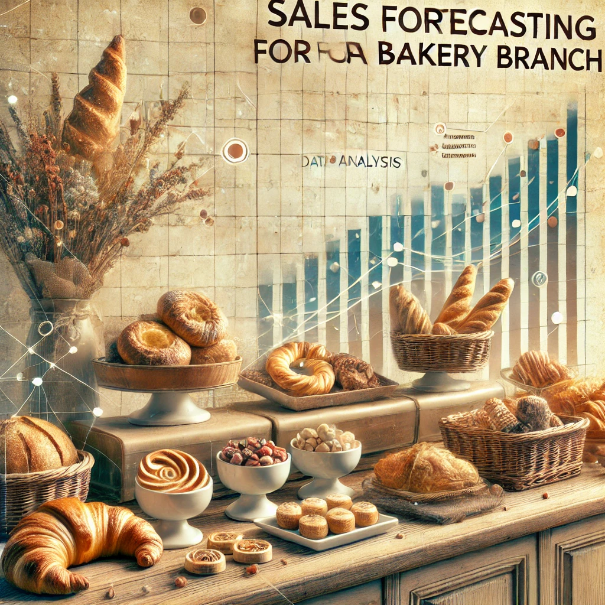

# Sales Forecasting for a Bakery Branch

## Repository Link

https://github.com/pepellia/bakery_sales_prediction

## Description

### Summary
A sophisticated time series forecasting project that predicts daily sales for six bakery product categories in Kiel, Germany. The project leverages local event data (Kieler Woche, Windjammer), weather conditions, and holiday patterns to enhance prediction accuracy, achieving competitive MAPE scores across all product categories. Through systematic experimentation with multiple modeling approaches, we developed an advanced neural network architecture that effectively captures both seasonal patterns and event-driven sales fluctuations.

### Detailed Overview
This project implements a multi-stage approach to sales forecasting for a bakery branch, analyzing historical data from July 2013 to July 2018. The forecasting pipeline consists of:

1. **Data Integration & Preprocessing**
   - Core sales data for six product categories: Bread, Rolls, Croissants, Confectionery, Cakes, and Seasonal Bread
   - Weather data integration (temperature, precipitation)
   - Local event calendars (Kieler Woche festival, Windjammer events)
   - Public and school holiday schedules for Schleswig-Holstein

2. **Feature Engineering**
   - Temporal features (day of week, month, season)
   - Weather-based features with seasonal temperature categorization
   - Event proximity indicators
   - Holiday impact modeling
   - Product availability patterns
   - Rolling statistics and lag features
   - Cyclical time encoding

3. **Model Evolution**
   We explored four distinct modeling approaches:
   
   a. **Linear Regression Models**
      - Baseline implementation for trend analysis
      - Separate models per product category
      - Integration of basic temporal and event features
   
   b. **Fourier Analysis**
      - Decomposition of time series into seasonal components
      - Capture of periodic patterns in sales data
      - Integration with weather and event effects
   
   c. **Neural Network Architecture**
      - Our best-performing approach (v14)
      - Comprehensive event integration (Windjammer, Public Holidays, School Holidays)
      - Weather and Kieler Woche festival effects
      - Date-based train/validation split strategy
      - Optimized neural network architecture
      - Robust evaluation framework
   
   d. **Hybrid Models**
      - Combination of Fourier analysis and neural networks
      - Attempted to leverage strengths of both approaches
      - Integration of frequency-domain features
   
4. **Evaluation**
   - Test period: August 2018 to July 2019
   - Primary metric: Mean Absolute Percentage Error (MAPE)
   - Separate evaluation for each product category
   - Visualization tools for model performance analysis
   - Comparative analysis across all modeling approaches

The final implementation (neural_network_model_v14) demonstrates superior performance by effectively integrating multiple event types (Windjammer Parade, public holidays, school holidays) along with weather data and the Kieler Woche festival impact, providing reliable forecasts for inventory management and staff planning.

### Task Type

Time Series Forecasting (Multi-output regression with temporal dependencies)

### Results Summary

-   **Best Model:** [neural_network_model_v14.py]
-   **Evaluation Metric:** MAPE
-   **Result by Category** (Identifier):
    -   **Bread** (1): [52,9]%
    -   **Rolls** (2): [18,3]%
    -   **Croissant** (3): [25,8]%
    -   **Confectionery** (4): [66,8]%
    -   **Cake** (5): [36,8]%
    -   **Seasonal Bread** (6): [240,3]%

## Documentation

1.  [**Data Import and Preparation**](0_DataPreparation/)
3.  [**Dataset Characteristics (Barcharts)**](1_DatasetCharacteristics/)
4.  [**Baseline Model**](2_BaselineModel/)
5.  [**Model Definition and Evaluation**](3_Model/)
6.  [**Presentation**](4_Presentation/Umsatzvorhersage_Bäckerei_Präsentation.pdf)

## Cover Image

